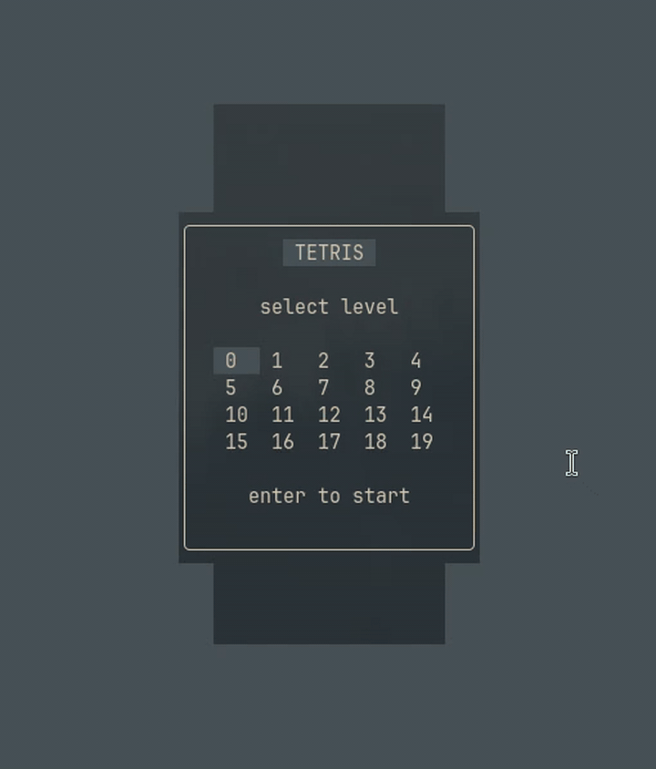
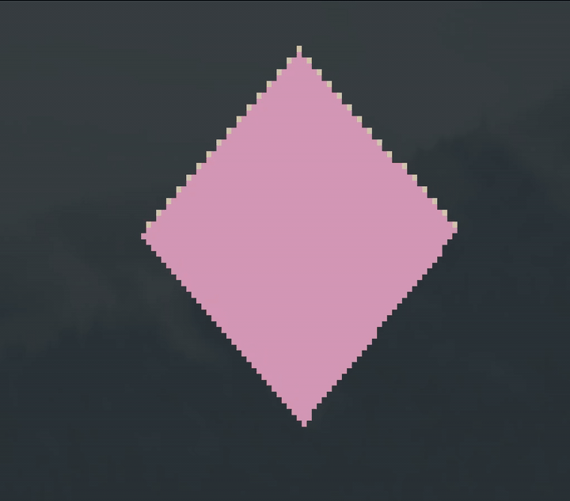
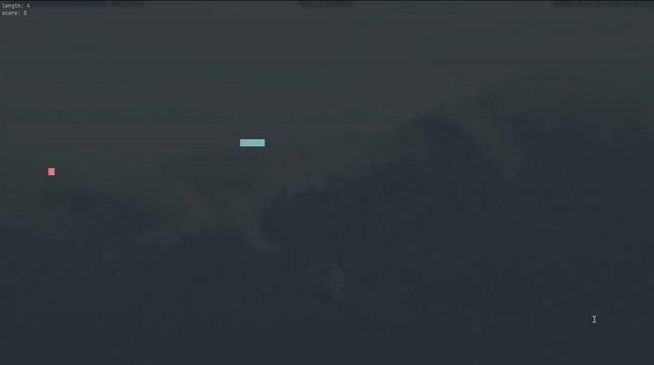

# TGE - Terminal Game Engine

## Examples
Framerates run substantially faster than in these gifs!
<table>
  <tr>
    <td width="33%" align="center"><br><em>Tetris</em></td>
    <td width="33%" align="center"><br><em>Cube</em></td>
    <td width="33%" align="center"><br><em>Snake</em></td>
  </tr>
</table>

## What is this?
This is a complete set of multi-platform terminal rendering, input, event, and life-cycle management tools.

## How to use it.
Still need to write docs, but it will be cool :)

<details>
<summary>Getting Started</summary>

<blockquote>
<details>
<summary>Simple Program</summary>

To get a game up and running, you need to initialize the game manager, and begin its execution loop:

```cpp

class MyGame : public tge::GameManager {
public:
    MyGame() : tge::GameManager() {}
    void Update() override {
        if (tge::Keyboard::GetKeyDown(tge::Key::Q)) {
            Quit();
        }
    }
};

int main() {
    auto game = MyGame();
    game.Run();
}
```

This driver code will launch the app with an empty screen, and can be quit using the `Q` key.

</details>
</blockquote>

<blockquote>
<details>
<summary>Hello World</summary>

This engine uses a custom rendering system, read about it in the `How it Works` section.

Here's an example of rendering Hello world at the top left of the screen, and in the middle of the screen:

```cpp
class MyGame : public tge::GameManager {
public:
    MyGame() : tge::GameManager() {}

    void Update() override {
        if (tge::Keyboard::GetKeyDown(tge::Key::Q)) {
            Quit();
        }
    }

    void Render() override {
        render.DrawStringAtXY({0, 0}, L"hello world!");
        render.DrawStringAtXY(tge::Terminal::Size() / 2 - tge::Vector2i{6, 0}, L"hello world!");
    }
};
```

</details>
</blockquote>


</details>

<details>
<summary>How it works</summary>

<blockquote>
<details>
<summary>Rendering</summary>

The secret sauce is in how the characters are rendered to the screen. The program uses a custom class for
drawing to the terminal. This class emulates a console buffer per-character, and allows you to write to the *next*
frame without disturbing the current one - then swaps the buffers, like in traditional computer graphics :)

The primary difference is that the buffer-swap *only* redraws characters that have changed since the last frame,
significantly reducing the required number of cursor movements and character prints.

</details>
</blockquote>

</details>


